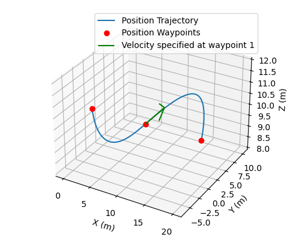

# Minsnap Trajectories

Simple Python/Numpy implementation of the Minimum Snap Trajectory Generation algorithm.

This package addresses the shortage of turnkey minsnap trajectory generator implementations on PyPI. It implements two of the most time-tested algorithms in this area:

- Mellinger and Kumar's original Minimum Snap Trajectory Generator [[1]](#1)

- Roy and Bry's numerically stable, unconstrained quadratic program [[2]](#2)

and an important utility in generating quadrotor trajectories:

- [Aerodynamic-effects-aware flatness map](https://github.com/ZJU-FAST-Lab/GCOPTER/blob/main/misc/flatness.pdf) from flat outputs to quadrotor state and inputs

---

<a id="1">[1]</a>: D. Mellinger and V. Kumar. Minimum snap trajectory generation and control for quadrotors.
In *Proc. Int. Conf. on Robotics and Automation*, 2011

<a id="2">[2]</a>: C. Richter, A. Bry, and N. Roy. Polynomial trajectory planning for aggressive quadrotor flight in dense indoor environments.
In *Int. Symposium on Robotics Research*, 2013

## Get Started

Note that this package is imported as follows

``` python
import minsnap_trajectories as ms
```

### TLDR

Four key names

- `ms.Waypoint`: Time, position, velocity, etc. waypoint. A sequence of this defines the trajectory
- `ms.generate_trajectory`: Generates the piecewise-polynomial trajectory
- `ms.compute_trajectory_derivatives`: Samples the polynomial for position/velocity/acceleration, etc.
- `ms.compute_quadrotor_trajectory`: Directly compute quadrotor state/inputs along the trajectory

### Full usage example



Define a sequence of position (and optionally velocity, acceleration, higher-order) references  

``` python
refs = [
    ms.Waypoint(
        time=0.0,
        position=np.array([0.0, 0.0, 10.0]),
    ),
    ms.Waypoint(  # Any higher-order derivatives
        time=8.0,
        position=np.array([10.0, 0.0, 10.0]),
        velocity=np.array([0.0, 5.0, 0.0]),
        acceleration=np.array([0.1, 0.0, 0.0]),
    ),
    ms.Waypoint(  # Potentially leave intermediate-order derivatives unspecified
        time=16.0,
        position=np.array([20.0, 0.0, 10.0]),
        jerk=np.array([0.1, 0.0, 0.2]),
    ),
]
```

Generate a piecewise polynomial trajectory using Roy and Bry's closed form solution, minimizing jerk (order-3) AND snap (order-4) while constraining position, velocity, etc... up to jerk (orders 0 to 3) to be continuous

``` python
polys = ms.generate_trajectory(
    refs,
    degree=8,  # Polynomial degree
    minimized_orders=(3, 4),  
    continuous_orders=3,  
    algorithm="closed-form",  # Or "constrained"
)

# Inspect the output
t = polys.time_reference
dt = polys.durations
cfs = polys.coefficients
```

Sample the polynomial trajectory to get position, velocity, acceleration (or higher-order) trajectories

``` python
t = np.linspace(0, 16, 100)
#  Sample up to the 3rd order (acceleration) -----v
pva = ms.compute_trajectory_derivatives(polys, t, 3)
position = pva[0, ...]
velocity = pva[1, ...]
```

Or directly generate a quadrotor UAV trajectory

``` python
t = np.linspace(0, 15, 100)
states, inputs = ms.compute_quadrotor_trajectory(
    polys,
    t,
    vehicle_mass=1.0, # Quadrotor weight
    yaw="velocity", # Align yaw angle to quadrotor velocity
    drag_params=ms.RotorDragParameters(0.1, 0.2, 1.0),
)
```

## Limitations

Tests are not nearly enough!

Existing tests show that this piecewise polynomial planner behaves identically to two of the more *approachable* MATLAB-based trajectory generator implementations by [icsl-Jeon](https://github.com/icsl-Jeon/traj_gen-matlab) and [symao](https://github.com/symao/minimum_snap_trajectory_generation).

1. The polynomial planner is not well-guarded against the case when the polynomial planning problem is overconstrained, i.e.

   - The polynomial degree is too low
   - Too many orders of derivatives are constrained to be continuous

2. The quadrotor trajectory generator is not extensively tested (the rotor-drag effect compensation function is even more so).

Until more extensive tests are available, use the following parameters in polynomial planning (they are the defaults)

- `degree`: From 5 to 15
- `minimized_orders`: 5 (Minimum snap)
- `continuous_orders`: 3 (Just keep position/velocity/acceleration continuous)
